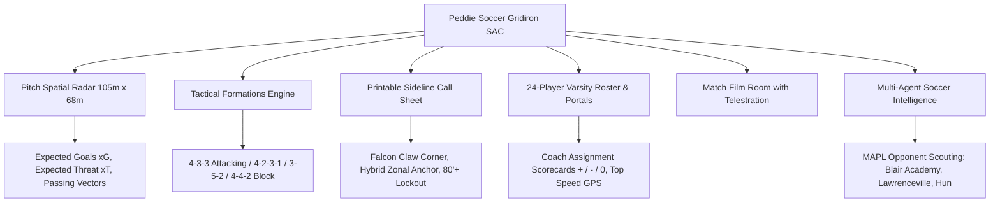

# ⚽ Peddie Soccer SAC — Broadcast-Grade AI Analytics & Coaching Platform

> **Peddie Soccer Strategic Analytics & Coaching (SAC)** is a production-grade, broadcast-quality soccer tactical analytics and coaching platform built specifically for **The Peddie School Varsity Soccer Program (MAPL Conference)** for the **2026–2027 Campaign**.

[](https://nextjs.org/)
[](https://www.typescriptlang.org/)
[](https://tailwindcss.com/)
[](https://vitest.dev/)

---

## ⚡ Key Architectural Modules



### 1. 🏟️ Regulation 105m x 68m Pitch Spatial Radar
- Vector arrow plotting for all passes, progressive carries, key chances, and goals.
- Field tilt percentage tracker showing territory dominance across 15-minute match intervals.
- Half-space channel guidelines and pressure entrapment zones.

### 2. 📋 Printable Sideline Call Sheet (`/dashboard/call-sheet`)
- High-contrast Peddie School branding optimized for clipboard printing (`@media print`).
- Attacking set-piece playbook (*Falcon Claw*, *Gold Horizon*, *Highstown Switch*).
- Hybrid zonal defensive corner marking assignments with #4 Julian Vance anchoring the central 6-yard box.
- Late-game 80'+ lead lockout protocol.

### 3. 👤 24-Player Varsity Roster & Recruitment Portal (`/dashboard/player-portal`)
- Grounded in official Peddie School Varsity Soccer records for the 2026–2027 campaign.
- Individual athlete performance telemetries (minutes, goals, assists, xG, xA, pass completion %, GPS sprint speed).
- Formal coach assignment scorecards (`+`, `-`, `0`) with specific game notes.

### 4. 🎥 Broadcast-Grade In-Match HUD & Telestration Room (`/dashboard/match-film`)
- Live scoreline with dynamic clock (74' vs Blair Academy Buccaneers, 2-1).
- Interactive video telestration suite with freehand pen, passing vectors, pressure boxes, and slow-motion frame stepping.
- Gemini natural language search for match highlights.

---

## 🛠️ Quick Start & Local Execution

```bash
# 1. Install dependencies
npm install

# 2. Run unit test suite
npm test

# 3. Start development server on port 3001
npm run dev

# 4. Build for production
npm run build
```

---

## 📜 License
MIT License. Built for The Peddie School Athletics & Soccer Program.
